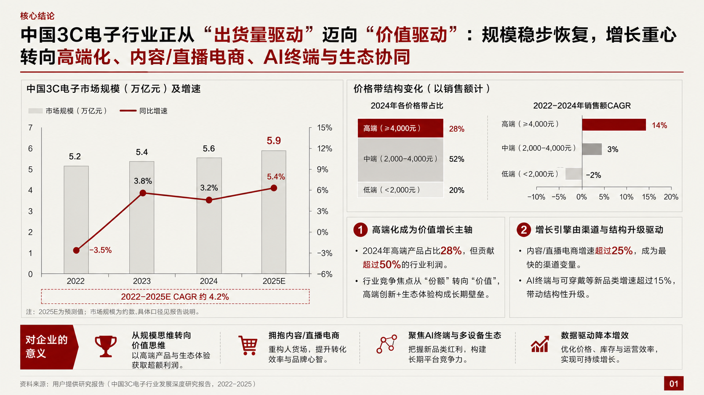
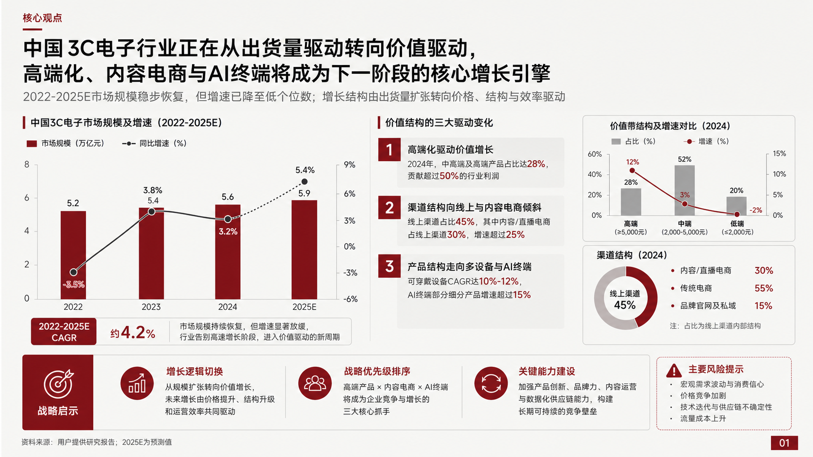
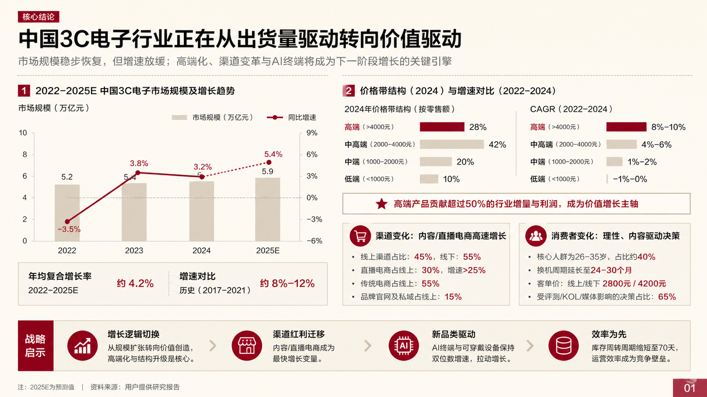
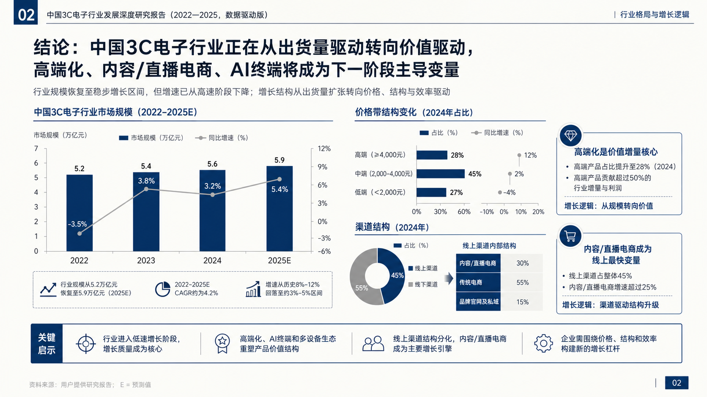
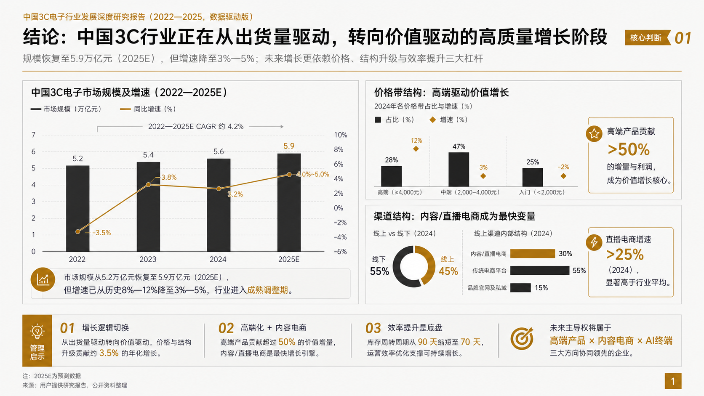
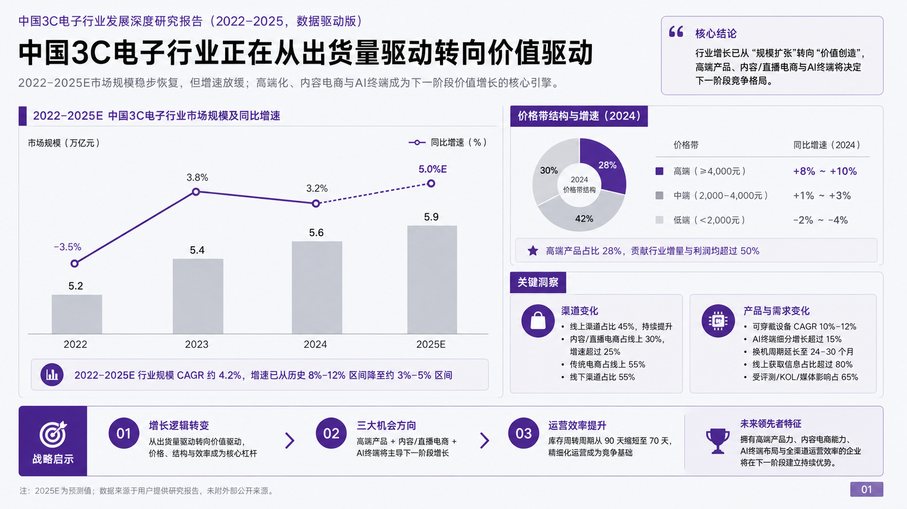

# CyberPPT

[中文](#中文) | [English](#english)

## 中文

CyberPPT 是一个 Codex Skill，用于将文档、研究材料和业务数据转化为高密度、可编辑、咨询风格的 PowerPoint 演示文稿。

它适用于行业研究、消费品分析、品牌战略、电商分析、用户研究、管理层汇报和客户提案等场景。

### 核心能力

- 在制作幻灯片前先完成基于证据的源材料分析。
- 使用 SCR 叙事结构：Situation（背景）、Complication（矛盾）、Resolution（解决方案）。
- 在大纲、视觉方向和最终成稿三个阶段设置明确的用户确认点。
- 默认生成 5 个独立的 16:9 视觉风格方向，不使用拼图或压缩画布。
- 最终 PPT 使用原生可编辑元素，包括文本、形状、表格和图表。
- 提供 PPTX 结构校验脚本，用于发现非 16:9 页面、越界元素、占位符文本和整页截图等风险。

### 8 套配色样张

CyberPPT 内置 8 套咨询报告配色。Skill 会根据材料类型推荐方案，但最终由用户选择。

| 方案 | 样张 |
|---|---|
| 01 经典深红咨询风 |  |
| 02 冷灰 + 勃艮第红 |  |
| 03 暖米白 + 暗酒红 |  |
| 04 象牙白 + 深蓝强调 |  |
| 05 浅灰白 + 墨绿色强调 |  |
| 06 纸张米色 + 铜棕强调 |  |
| 07 纯净浅灰 + 黑金强调 |  |
| 08 冷白灰 + 深紫强调 |  |

### 目录结构

```text
cyber-ppt/
  SKILL.md
  agents/
    openai.yaml
  references/
    source-analysis.md
    storyline.md
    visual-system.md
    ppt-production.md
    quality-assurance.md
  assets/
    palette-samples/
      palette-01.png ... palette-08.png
  scripts/
    validate_pptx.py
    test_validate_pptx.py
```

### 安装方式

将本仓库克隆或复制到你的 Codex skills 目录，并保持目录名为 `cyber-ppt`。

Windows PowerShell：

```powershell
git clone https://github.com/crazyykhllc-bit/CyberPPT.git "$env:USERPROFILE\.codex\skills\cyber-ppt"
```

macOS / Linux：

```bash
git clone https://github.com/crazyykhllc-bit/CyberPPT.git ~/.codex/skills/cyber-ppt
```

如果不使用 Git，也可以直接复制完整文件夹。文件夹根目录必须包含 `SKILL.md`。

### 使用示例

```text
使用 CyberPPT，把这个 DOCX/PDF/研究材料做成 7 页高密度咨询风 PPT。先生成大纲，再让我确认视觉风格，最后生成可编辑 PPT。需要使用 SCR 逻辑，并包含详细图表。
```

### PPTX 校验

校验生成后的 PPTX：

```bash
python scripts/validate_pptx.py path/to/deck.pptx --json-out path/to/report.json
```

运行测试：

```bash
python -m unittest scripts/test_validate_pptx.py -v
```

校验器关注结构和可编辑性风险，不能替代完整的逐页视觉检查。

### 隐私与素材安全

`.gitignore` 已默认排除常见素材文件、演示文稿输出和本地预览结果，便于将仓库保持为干净的 Skill 源码项目。

### 许可证

MIT。详见 [LICENSE](LICENSE)。

## English

CyberPPT is a Codex Skill for turning source documents, research notes, and business data into high-density, editable, consulting-style PowerPoint presentations.

It is designed for industry research, consumer analysis, brand strategy, e-commerce analysis, user research, executive briefings, and client proposals.

### Core capabilities

- Perform evidence-based source analysis before slide writing.
- Use the SCR storyline structure: Situation, Complication, Resolution.
- Require explicit user approval gates for the outline, visual direction, and final deck.
- Generate five separate 16:9 visual style directions by default, without collages or compressed canvases.
- Build final PPT files from native editable elements, including text, shapes, tables, and charts.
- Provide a PPTX structural validator to detect risks such as non-16:9 sizing, off-slide elements, placeholder text, and full-slide screenshot shortcuts.

### Palette samples

CyberPPT includes 8 fixed consulting-report palettes. The skill recommends one based on the source type, but the final choice remains with the user.

| Option | Sample |
|---|---|
| 01 Classic deep-red consulting |  |
| 02 Cool gray + burgundy |  |
| 03 Warm ivory + dark wine |  |
| 04 Ivory + navy accent |  |
| 05 Light gray-white + dark green |  |
| 06 Paper beige + copper brown |  |
| 07 Clean light gray + black-gold |  |
| 08 Cool white-gray + deep purple |  |

### Repository layout

```text
cyber-ppt/
  SKILL.md
  agents/
    openai.yaml
  references/
    source-analysis.md
    storyline.md
    visual-system.md
    ppt-production.md
    quality-assurance.md
  assets/
    palette-samples/
      palette-01.png ... palette-08.png
  scripts/
    validate_pptx.py
    test_validate_pptx.py
```

### Installation

Clone or copy this repository into your Codex skills directory as `cyber-ppt`.

Windows PowerShell:

```powershell
git clone https://github.com/crazyykhllc-bit/CyberPPT.git "$env:USERPROFILE\.codex\skills\cyber-ppt"
```

macOS / Linux:

```bash
git clone https://github.com/crazyykhllc-bit/CyberPPT.git ~/.codex/skills/cyber-ppt
```

If you are not using Git, copy the full folder into the same location. The folder must contain `SKILL.md` at its root.

### Usage example

```text
Use CyberPPT to turn this DOCX/PDF/research material into a 7-page high-density consulting PPT. First generate the outline, then ask me to confirm the visual style, then create an editable PPT. Use SCR logic and include detailed charts.
```

### PPTX validation

Validate a generated PPTX:

```bash
python scripts/validate_pptx.py path/to/deck.pptx --json-out path/to/report.json
```

Run tests:

```bash
python -m unittest scripts/test_validate_pptx.py -v
```

The validator focuses on structural and editability risks. It does not replace full-slide visual review.

### Privacy and source material

The `.gitignore` excludes common source materials, presentation outputs, and local preview artifacts by default, keeping this repository focused on the Skill source files.

### License

MIT. See [LICENSE](LICENSE).
